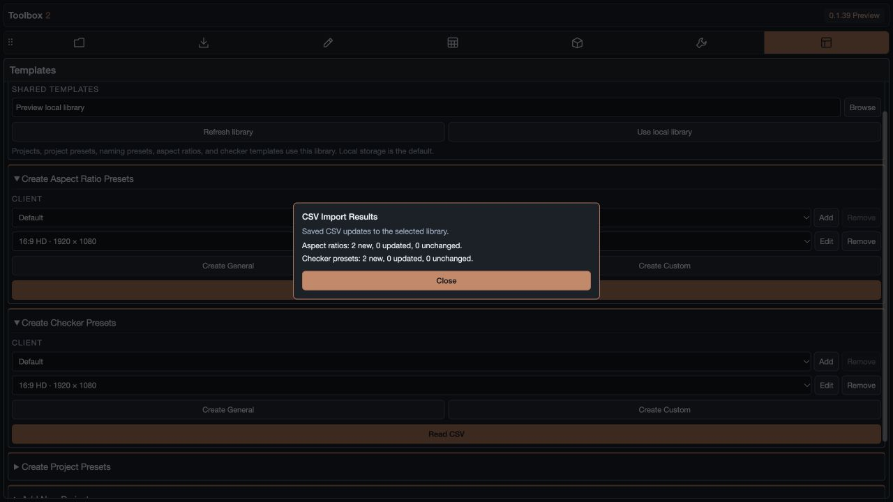

# Client Formats and CSV Updates

Available in **Toolbox 2 v0.1.39**. [Panel guide](PANELS.md) · [Installation](../README.md)

The existing composition formats remain under **Default**. Client selectors filter formats in **Create Composition**, **Modify Composition**, and **Create Checkers**. Create Checkers lives in Covers / Checkers, below Create Cover. Dimensions and FPS follow the selected preset; Custom unlocks manual inputs.

Under Templates, **Create Aspect Ratio Presets** and **Create Checker Presets** each offer Client, Add, Remove, Edit, Create General, Create Custom, and a full-width **Read CSV** button. General Format retains the name, naming code, dimensions, and asset list, with added Client and FPS fields. A new form inherits the selected client. Removing a client moves its presets to Default; it does not delete the preset definitions or native checker media. Default cannot be removed.

## Importing and Reimporting

1. Select your local or shared library in **Shared Resources**.
2. Click **Read CSV** in either preset panel and select the latest CSV.
3. Valid new or changed definitions save automatically to the selected library.
4. The results popup lists new, updated, and unchanged counts and incomplete-row notices. Close it to continue.

There is no separate CSV import panel or Apply button. Cancelling the file browser makes no changes.

Try [the Example Studio CSV](examples/client-formats.csv) to create two example formats using artwork already bundled with Toolbox. The screenshot below shows the preview import; saving through CEP writes the selected real library.

Each valid CSV row creates an aspect-ratio definition and a general-checker definition. Matching uses the client and format code, independent of the display label. Reimporting an unchanged CSV adds no duplicates and requires no library write. Changed labels, dimensions, and asset paths update the existing imported definitions. Changing a format code or client identifies a new format. The built-in Default presets and unrelated manual presets are preserved.

CSV imports keep definitions for rows omitted from a later file. Previously removed CSV presets remain removed. A removed client can be recreated by a later import without colliding with the presets moved to Default. Conflicting duplicate client/code rows are reported and skipped; identical duplicate rows collapse into one definition.

## Columns

| CSV column | Meaning |
| --- | --- |
| CLIENT | Client name. Blank cells inherit the preceding client. `Default (Mocean)` maps to Default. Client-only rows register the client without creating a format. |
| PREFIX (Menu Item Name) | Display label in the format dropdown. |
| ASPECT (Format Code) | Naming code, such as `AZ-STRY`. Use letters, numbers, underscores, and hyphens. |
| SizeX / SizeY | Width and height. Both must be whole numbers from 1 to 30000. |
| FPS (optional; Frame Rate is also accepted) | Preset frame rate from 1 to 240. Missing values preserve existing imported FPS; a new preset or legacy composition format defaults to 23.976. |
| Matte | Optional matte file path. |
| Chart1 / Chart2 | Optional guide file paths. |

Quoted commas, escaped quotes, multiline quoted values, UTF-8 BOMs, and Mac/Windows line endings are supported. Accidental closing quote marks after guide paths are stripped. Absolute Mac, Windows, and UNC paths are supported, as are existing `library:` and `bundled:` asset references.

Blank or `IN PROGRESS` asset cells preserve existing assignments. `N/A` or `None` explicitly clears an assignment. Notes such as “need 4x5 safe zone” are reported as pending, not treated as filenames. Rows missing a name, code, or valid dimensions are skipped without overwriting existing presets.

## Shared Storage and Generation

Clients, imported aspect ratios, and general-checker definitions are stored in the selected library's `project-templates.json`, through the same lock and revision checks as other presets. Refresh the library on another workstation to load the updates. The local library is used when no shared folder is selected.

CSV guide paths remain references to their original files. Those files must be accessible to each workstation; import does not copy network media or translate mount names. General Format's normal asset browser/save flow still copies assets into the library. Missing guide files are reported when creating a comp or checker; checker generation checks guide availability before creating checker compositions.

Create Composition uses the selected client's naming code, dimensions, and FPS, and optionally adds its stored guides. Modify Composition uses the selected dimensions and replaces the old preset guides; when FPS is checked, it applies the preset FPS. General checkers use the selected target dimensions, preset FPS, matte, and chart files, preserving the graphic comp's duration; legacy checker formats without FPS keep the graphic comp's FPS. Custom checkers keep their existing native-template replacement workflow and can be assigned to a client during capture.

Reference layers are centered at half the composition dimensions, with Guide 1 above Guide 2, other guides, and then the matte layers. Guides use 50% opacity; mattes use 100%. Both are marked as non-rendering guide layers, matching the existing reference-overlay behavior. Missing guide files are checked before composition creation.

## Temporary HD Test Template

For a macOS development checkout, run `python3 scripts/create-hd-test-fixtures.py` to generate temporary PNG files, the CSV, and its JSON definition. `/private/tmp/toolbox-hd-fixtures/HD_Test_Formats.csv` defines a Toolbox Test client and a 1920×1080, 24 FPS preset. Its PNG files contain safe-area guides, a grid, and a 2.39 letterbox matte. Read this CSV to test the complete import workflow. The generated native test comp is `TEST_HD-TEST_A_HD_guides_v01_DR`, inside `Toolbox HD Template Test (Temporary)`.

`tests/hd-template-native.jsx` reads the generated JSON definition, creates the composition through the Toolbox host action, and verifies dimensions, FPS, guide/matte stacking, centering, asset reuse, Add Guides off, and missing-file handling. The test leaves one composition with graphic placeholders available for visual inspection and writes `/private/tmp/toolbox-hd-fixtures/native-results.json`.

## Validation

Local tests cover repeat imports, individual changes, client inheritance, quoted paths, pending assets, incomplete dimensions, conflicting duplicates, removal/reimport, and shared-library round trips. Browser checks cover the real file picker, direct imports, client filtering, and client management. Native AE 26.5 validation covers checker dimensions, guide insertion and centering, timing, and source preservation. External network guide paths require the shared drive to be mounted when used.

A duplicate of the source CSV was changed with three new dummy formats, one changed existing row, and one identical duplicate row. Results for **each** preset category:

| Import | New | Updated | Unchanged |
| --- | ---: | ---: | ---: |
| Original file | 21 | 0 | 0 |
| Updated file | 3 | 1 | 20 |
| Updated file repeated | 0 | 0 | 24 |

Both the UI and native save/reload checks passed. There were no duplicate IDs, imported client/code pairs, or client entries. The changed row retained its ID, all 14 built-in Default presets were preserved, and the unchanged repeat required no library write. These checks used an isolated local library; simultaneous use on an actual network share remains unverified.
