# Toolbox 2 panel guide

For **0.1.33 Alpha 1**. [Home and installation](../README.md)

Screenshots are browser layout previews for the 0.1.33 Alpha 1 documentation. They use default values and may show no connected project; the browser cannot execute AE host operations. Scroll inside the panel to reach modules below the visible area.

## Navigation and saved layout

The orange toolbar selection identifies the active section. Drag the dotted grip to dock the toolbar at the top, bottom, left, or right; arrow keys also select an edge when the grip has focus. Escape cancels a drag. Each main module can collapse independently. The selected section, collapsed states, and dock position are saved on that workstation.

## Projects

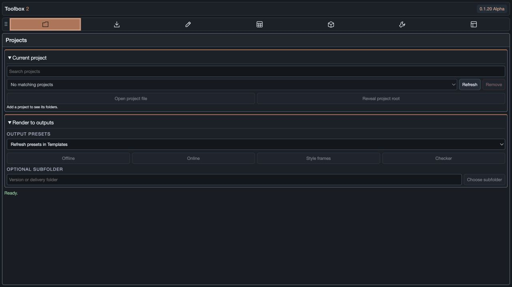

### Current project

Search by project name or root path, then select a result in the dropdown. **Refresh** reloads project data. **Remove** removes the connection; it is not a disk-file deletion tool. Add connections in **Templates → Add new project**.

The button beneath the project selector shows its assigned template. Click it to choose another template, then **Save** to store the assignment for that project or **Cancel** to leave it unchanged. Saving refreshes folder mappings and composition naming; existing files and comps are not moved or renamed.

**Open project file** opens the connected project's AE file; **Reveal project root** opens its root folder. The folder list below resolves the template's AE Projects, Assets, Graphic In, Graphic Out, Style Frames, and custom locations against that root. Each folder provides adjacent **Reveal** and **Import** actions. Saving a project preset refreshes the mappings used by connected projects.

### Render to outputs

Choose **Output Presets**, enter or choose an Optional subfolder if needed, then click **Render to outputs** below that row. Select the comps in AE before rendering.

The first bordered destination uses the current project's Graphic Out / Outputs mapping. Custom locations marked **Render output** in the project preset add more bordered sections below it, each with its own Optional subfolder, Choose subfolder, and **Render to [location]** button. Subfolder values are independent per project, template, and destination during the panel session:


- Without an optional subfolder: `Outputs/26_0916`.
- With `review/v01`: `Outputs/review/v01/26_0916`.

The date folder uses `YY_MMDD` and comes last. Legacy Offline, Online, and Checkers subfolder settings no longer drive rendering. The four mode buttons and render-subfolder fields in Create project presets have been removed. Older screenshots may show the pre-0.1.33 layout; the destination sections described here match 0.1.33 Alpha 1.

Output filenames follow this studio format:

```text
[compName]_[frameRate]fps_[width]x[height].[fileExtension]
```

For example: `ABA_9x16_A_new_v01_dr_23_976fps_1080x1920.mp4`.
The comp name is preserved, FPS uses up to three decimal places with an underscore replacing the decimal point (`23_976fps`, `29_97fps`, `59_94fps`; whole rates remain `24fps`). This only formats the filename; the composition frame rate is unchanged. Dimensions come from the selected comp. The extension comes from AE's output module. Image sequences retain the preset's frame-number suffix before the extension so individual frames have unique filenames.

The selected output-module name is applied to AE's installed template of exactly that name. AE supplies the extension and sequence numbering. Existing render-queue enabled states are restored after the workflow. Save the AE project and select comps before rendering. See [Load AOM presets](#load-aom-presets) for setup.

## Sourcing

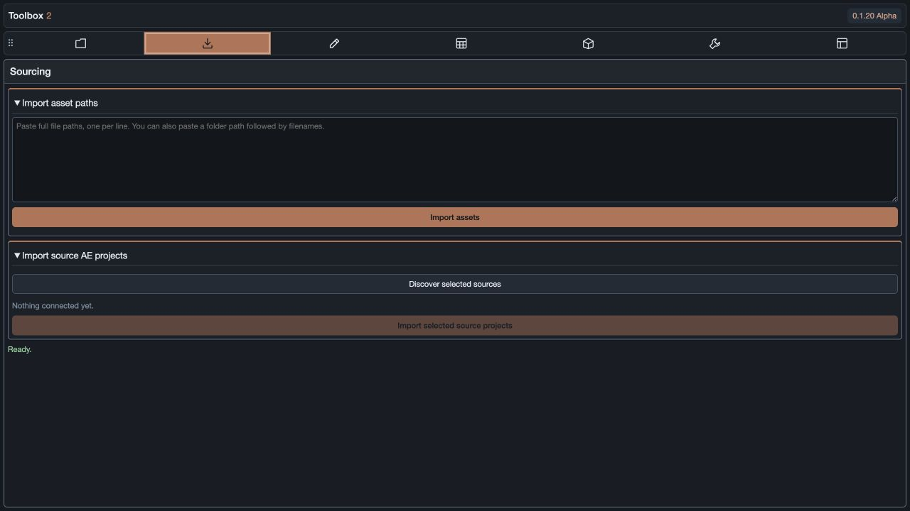

### Import asset paths

Paste full file paths, one per line, and click **Import assets**. Folder headers followed by filenames are also supported. Absolute Mac paths, Terminal-escaped spaces, Windows drive/UNC paths, and file URLs are recognized. Results and errors appear in the panel.

### Import source AE projects

Select rendered footage or still images in AE's Project panel, then click **Discover selected sources**. Review the discovered project links and import the selected source projects.

Discovery reads selected image and video files through After Effects' XMP reader, then checks embedded XMP packets and both common `.xmp` sidecar names when a container reader cannot open the file. It accepts the AE project-link fields written by different AE versions, including structured `creatorAtom:aeProjectLink` data, flat project-path fields, and file URLs. The metadata must include an explicit source-AE-project link; an image's generic metadata or color profile alone cannot identify its original project. Missing/offline project files are reported rather than invented.

The color-space line reads the current project's working space when applicable, or saved settings from supported unopened `.aep`/`.aepx` files without switching the active project. None, sRGB IEC61966-2.1, and Rec.709 Gamma 2.4 were verified using real AE-saved fixtures in both formats. Files over 256 MB, unknown layouts, and unsupported OCIO settings report unavailable. This is the source **project working space**, not the rendered image's embedded profile.

## Create / Modify

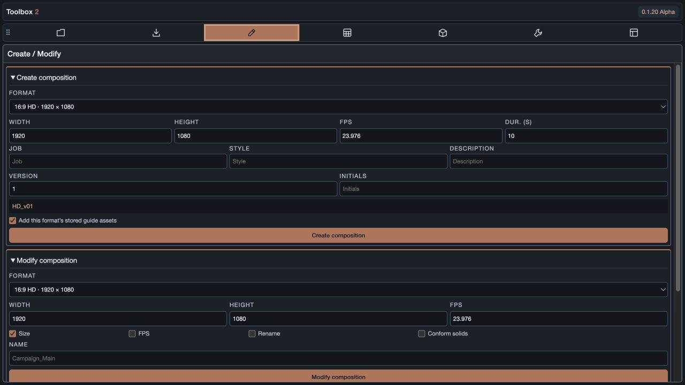

### Create composition

Choose a format or Custom, then set dimensions, FPS, and duration. Naming inputs follow the current project template and expand to fill available rows. The live preview shows the resulting name; empty text fields are omitted.

The default order is `Job_Format_Style_Description_v01_Initials`. The format uses a separate naming code: 9:16 TikTok safe produces `9x16`, not its display label. Example: `ABA_9x16_A_NewCard_v01_DR`.

**Add this format’s stored guide assets** is enabled by default. The selected format's mattes/guides are imported as guide layers when checked.

### Modify composition

Select comps in AE's Project panel. Choose this module's independent format dropdown and dimensions. Enable only the operations required:

| Option | Effect |
| --- | --- |
| Size | Updates dimensions; a preset replaces existing Toolbox format guides with its own assets. Custom dimensions retain existing guides. |
| FPS | Applies the entered frame rate. |
| Rename | Applies the requested name. |
| Conform solids | Conforms direct solid layers inside the modified comps to their dimensions. |

Other layers and unrelated user guide layers are preserved; duration remains unchanged. This is not the original temporary-null content-resizing workflow. Conforming does not recurse into nested comps and uses separate solid sources so other comps sharing the original solid are not changed. Expression-driven anchor points are left intact.

### Renamer

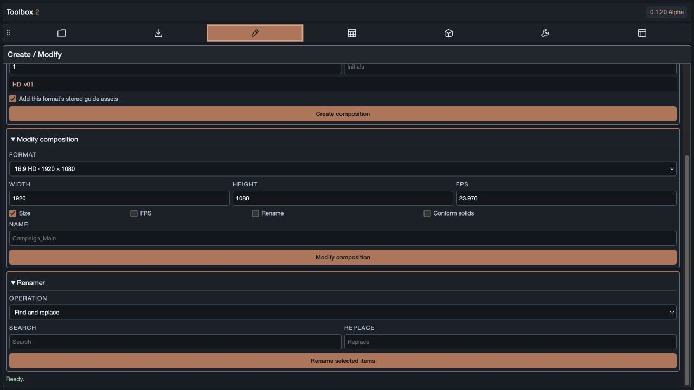

Apply Find and replace, Add prefix, Add suffix, Append sequence, or Remove text to selected project items. Search text is literal: characters such as `[` and `.` are not regular-expression commands.

## Covers / Checkers

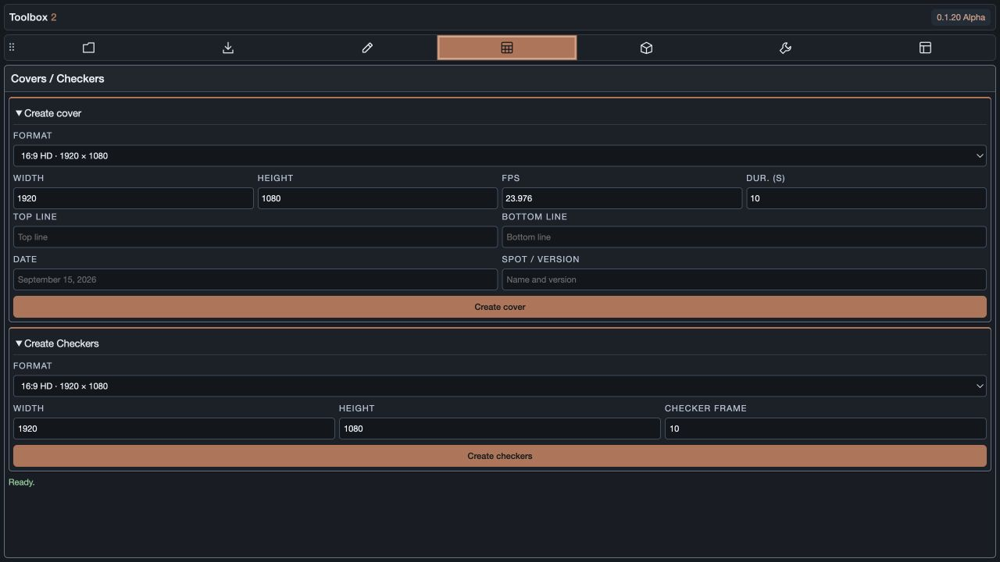

### Create cover

Choose a format, dimensions, duration, and FPS. Fill Top line, Bottom line, Date, and Spot / version, then click **Create cover**. The result is an editable AE comp with background and named text layers.

### Create Checkers

Select graphic comps in AE and choose a format. General checkers use the Width, Height, and **Checker frame** controls; the chosen frame is held. Custom presets instead import their saved template and preserve its timing. Custom presets require a Job code and do not use the General checker held-frame setting.

Each selected graphic creates its own checker. Render the generated comps using **Projects → Render to outputs → Render to outputs**.

### Custom checker template preparation

1. Prepare a dedicated project containing checker templates and their dependencies. Save it as `.aep` or `.aepx` with no unsaved changes.
2. Include a precomp layer named exactly `REPLACE THIS LAYER WITH GRAPHIC COMP` and a text layer named exactly `XXXX`. These may be nested. Disable source-text expressions on `XXXX`.
3. Select the template comps and use **Templates → Create aspect ratio presets → Create Custom → Use selected comps**. Batch selection creates multiple presets.
4. Choose the resulting custom preset in Create Checkers, enter the Job code, select the graphic comps, and create.

The graphic source is replaced **in place**, keeping layer order, transforms, and template timing. `XXXX` receives the Job code while retaining text styling. Other layers, artwork, visibility, and expressions remain in the native template. Other text labels are not automatically rewritten.

Capture stores `project.aepx`, `template.json`, and copied dependencies in a package under the chosen library. It restores the source project file path after capture; it does not close or reduce the open project. Each generated checker imports a separate copy of the dedicated template project, including its other template comps. Keep that project focused to avoid unnecessary imports.

Media references use package-relative paths and are resolved to the local library mount on import. Layered media and numbered sequences retain their native import settings. Missing media stops the operation. Fonts/plugins must be installed on every workstation. Expressions with external comp dependencies or absolute paths need a self-contained template. Older binary `.aep` development packages should be recaptured for layered-media portability.

#### Frame-rate-aware frame counters

If your template expression calculates the source-to-checker frame-rate ratio using a fixed 60 FPS:

```jsx
fMult = fFrameDurVal / 60;
```

replace that line in the template with:

```jsx
fMult = fFrameDurVal * thisComp.frameDuration;
```

Here `fFrameDurVal` is the source comp's FPS. Multiplying by the checker comp's frame duration removes the fixed-60 assumption. An existing `thisComp.layer(4)` reference remains valid when the placeholder stays at layer 4, because source replacement does not insert/delete that layer. This recipe assumes the rest of the original counter's timing logic; time remapping/stretching needs separate handling. Toolbox preserves expressions—it does not automatically apply this edit.

## Cleanup / Collect

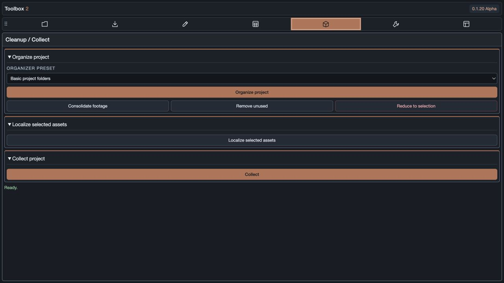

### Organize project

Choose Basic project folders or a DMS aspect-ratio preset, then **Organize project**. Organization changes folders inside AE's Project panel, not the disk folder layout. Selected Project-panel items remain at the root and are excluded from routing. Selected folders keep their unselected contents together. The organizer runs as one undo step and does not remove folders.

The maintenance buttons are in this same module:

- **Consolidate footage:** invokes AE's consolidation operation.
- **Remove unused:** removes unused project items.
- **Reduce to selection:** reduces the project to selected items and their dependencies.

### Comp Cleanup

Open a composition and choose **Analyze composition**. Toolbox walks the active composition and nested precomps through After Effects' public Layer and Property APIs. It records parenting, track mattes, precomp sources, layer-index properties exposed by effects, and resolvable named expressions. The results dialog lists every analyzed layer as **SAFE TO REMOVE**, **KEEP**, or **AMBIGUOUS**, with the reason for each classification.

Each analyzed layer is shown as its own module with a clearly labeled checkbox. **SAFE TO REMOVE** entries start checked; **KEEP** and **AMBIGUOUS** entries start unchecked and their checkboxes are disabled because they are protected. Choose or clear the available checkboxes to decide the final cleanup set, then choose **Clean up selected safe layers** only after reviewing the results. The action removes only the checked layers that remain **SAFE TO REMOVE** after a fresh reanalysis and runs as one undo step. Enabled rendering layers, guides, adjustment layers, cameras, lights, locked layers, parent or matte dependencies, shared precomps, unresolved expressions, indexed expressions, and any hierarchy that AE does not expose are preserved or marked ambiguous. The analyzer does not inspect binary `.aep` data and does not assume a fixed list of third-party effects; a missing or opaque dependency fails closed.

Manual validation matrix: create a test comp with one disabled unrelated layer, a disabled layer selected by a Layer Control effect, a disabled track matte, a disabled parent null, named and index-based expression references, a three-level precomp chain, and a precomp also used by another comp. Add an adjustment layer, camera, light, guide, locked layer, and a third-party effect with both an exposed layer parameter and an opaque parameter if available. Run **Analyze composition**, confirm the unrelated layer is SAFE TO REMOVE, dependency cases are KEEP or AMBIGUOUS, the shared precomp is protected, and no composition changes before confirmation. Clear one safe checkbox, click **Clean up selected safe layers**, verify only the remaining checked safe layer is removed in the single **Toolbox - Comp Cleanup** undo step, undo it, and confirm every layer returns.

### Localize selected assets

Copies selected file-based footage into the current project's Assets location without overwriting an existing file. Use Collect for sequences and proxies.

### Collect project

**Collect** opens AE's native Collect Files dialog. Choose the collection options and destination there to finish; the button is not an unattended collector.

## Tools

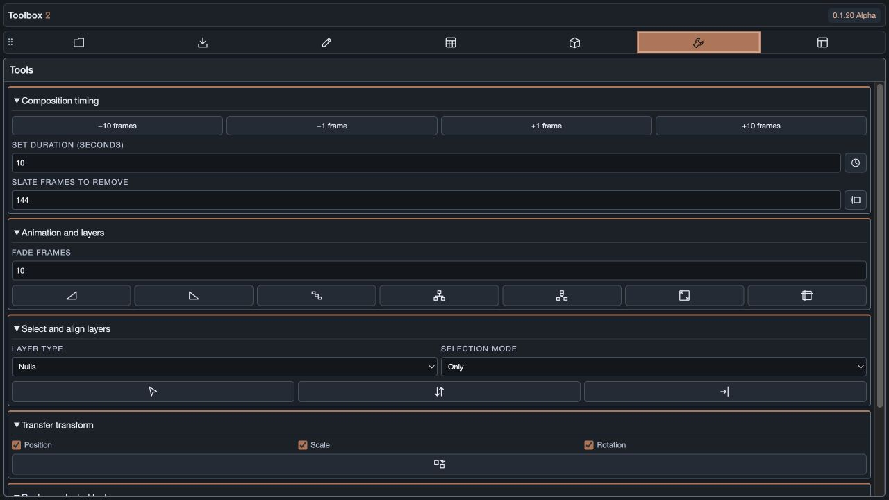

Hover icons to see the action names. Layer actions use the active comp and its selection; composition actions use selected comps where indicated. Tooltips are rendered by the panel so they remain available in the CEP host.

| Module | Controls and behavior |
| --- | --- |
| Composition timing | Change duration by −10, −1, +1, or +10 frames; set duration in seconds; create a no-slate comp from selected footage using the specified slate-frame count. Durations retain a one-frame minimum. |
| Animation and layers | Fade in/out buttons add or reuse named layer markers and an opacity expression; drag `fadeIn_start`/`fadeIn_end` or `fadeOut_start`/`fadeOut_end` markers in the timeline to change the duration. Sequence layers, parent to the last selected layer, parent selected layers to a centered new null, move keyed transform channels to animation parent nulls while leaving Opacity keys untouched, unparent, conform selected solids to the active comp, and toggle selected layers between guide and normal. Remembered Key graph and Placement tabs keep the cubic Bézier editor separate from the compact Set Anchor and Step and Repeat controls. |
| Select and align layers | Select by type using Only, Add, or Subtract; reverse selected stacking order; snap to last selected. Types include nulls, solids, shapes, comps, footage, text, cameras, and lights. |
| Transfer transform | Transfer checked Position, Scale, and Rotation components between selected layers. |
| Replace selected text | Replace selected text-layer contents; animated source text is written at the current time. |

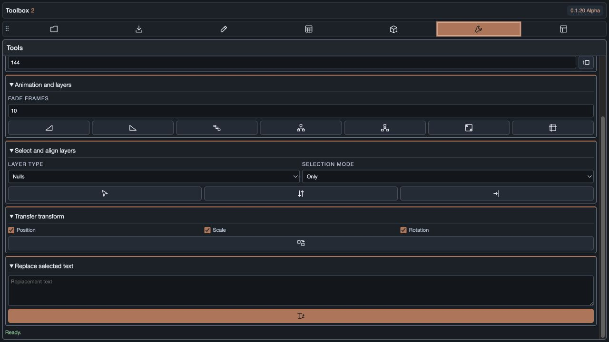

The Conform solids icon applies only to selected solid layers. Use the Modify composition checkbox to conform all direct solids in selected comps instead. AutoSplice is not included.

## Templates

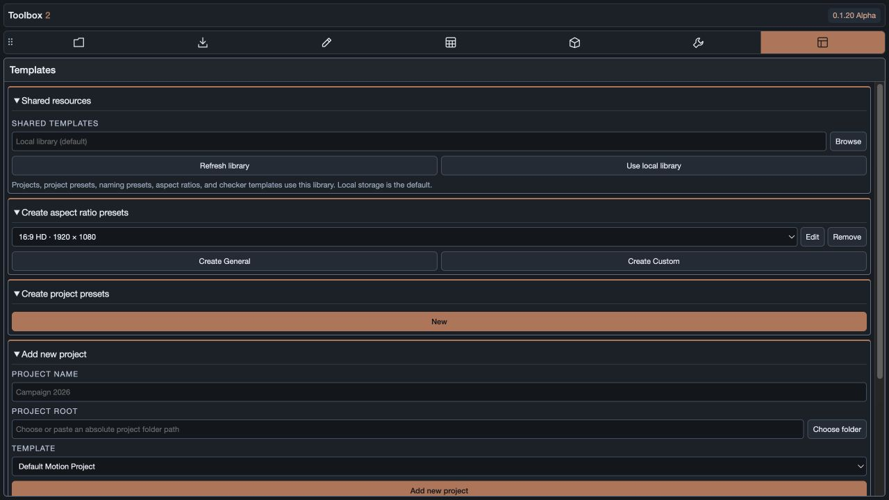

### Shared resources

This is the library setting for the whole Toolkit. **Shared templates → Browse** selects a library folder. **Refresh library** reloads it; **Use local library** returns to the workstation's local library.

| Stored in the chosen library | Remains workstation-specific |
| --- | --- |
| Connected project records; project presets and folder mappings; naming presets; composition formats; curve presets; checker packages and copied assets | Library mount choice; toolbar/tab/collapse state; selected AOM file and output-preset preferences; installed AE output-module settings |

With no shared folder selected, the default library uses AE's OS-resolved user-data location. Selecting an existing shared folder loads that folder's records. It does **not** merge or migrate local records automatically. Returning to local restores the retained local library. A new empty shared library starts with defaults and no connected projects.

All users must select the same shared library to see its saved presets, then refresh after another user's edits. New guide assets use library-relative references; custom checker packages resolve their own relative media paths. Existing absolute asset paths are not automatically migrated. Connected project roots remain absolute and must be accessible on each workstation; Toolbox does not translate drive letters or mount names for project roots.

A save lock blocks concurrent writes, and revision checks reject outdated saves. On a conflict, refresh and reapply your change instead of overwriting another user's work. Crash-leftover `.lock` files intentionally block writes; only remove one after confirming no workstation is still writing. These mechanisms were tested with local processes, not an actual two-machine network share.

### Create aspect ratio presets

Select an existing format to **Edit** or **Remove**, or choose **Create General** / **Create Custom**.

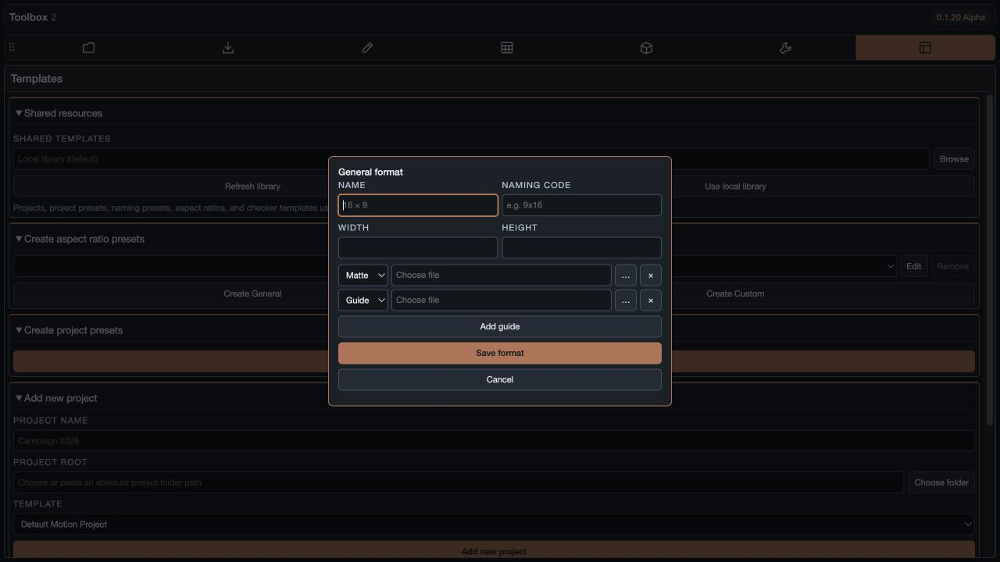

**Create General** exposes Name, Naming code, Width, Height, and a list of matte/guide assets. A new format starts with one Matte and one Guide row. **Add guide** adds a row; each row can change type, choose a file, or be removed. Save format stores the preset and assets for Create/Modify.

**Create Custom** captures the selected native checker comps; see [template preparation](#custom-checker-template-preparation). Removing a preset removes it from selection without deleting existing comps or package media. Preset data belongs to the currently selected library, so shared-library changes can affect other users after refresh.

Bundled formats: 16:9 HD, UHD 3840, 9:16 Social, 9:16 TikTok safe, 4:5 Social, 4:5 with 9:16 safe, 1:1 Square, HD letterbox 1.85/2.00/2.10/2.35/2.40/2.41, and HD 10/20. Original Toolbox guide artwork is bundled with the extension. The Naming code stays separate from the display label.

### Create project presets

Initially this module shows **New**. Click it to open the editor; choose a Saved preset to edit an existing one. **Close** hides the editor. There is no separate Project templates panel.

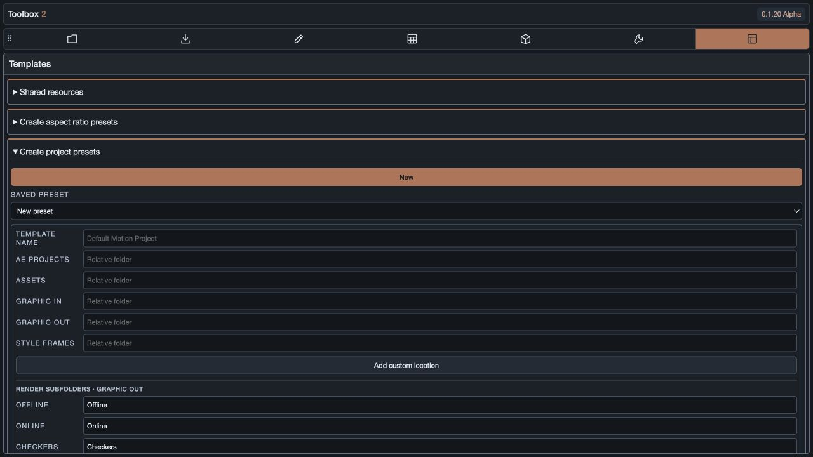

Enter a template name and relative folder paths for AE Projects, Assets, Graphic In, Graphic Out, and Style Frames. Use **Browse** beside any standard or custom folder field to select a subfolder. Paths are stored relative to the current project root; without a current project, choose a reference project root first. Selections outside that root are rejected. Add custom locations when needed. Check **Render output** to give that location a dedicated render section; unmarked locations remain available for Reveal/Import only. Save the preset to refresh render destinations automatically. The project root is chosen when adding a project, not stored in these relative folder fields.

The bordered **Comp naming** section contains a stacked module list. Drag to reorder, or focus a row and use Alt+Up/Down. Edit opens preferences with Save/Cancel; Remove deletes a module. **Add to template** opens a new module dialog.

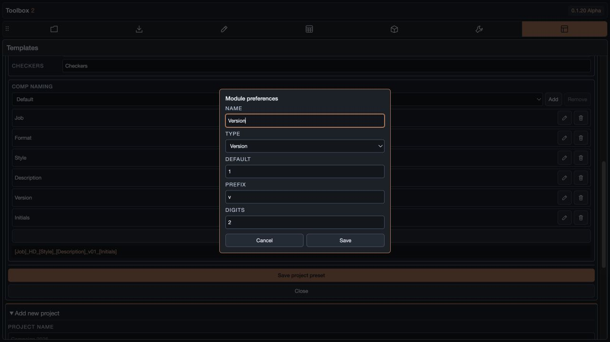

| Module type | Settings |
| --- | --- |
| Text | Name and default value, such as Job, Description, or Initials. |
| Version | Numeric default, prefix, and 1–6 padding digits. Default prefix `v` and two digits produce `v01`. |
| Comp format | Uses the selected format's Naming code. |

The Naming preset dropdown with **Add** / **Remove** saves and selects reusable module lists. Save a naming preset with Add, then **Save project preset** to apply the current fields and folder mappings to the project preset. Blank text modules appear as placeholders in the template preview. Existing comps are not renamed when a template changes. At least one naming field is required.

### Add new project

Enter Project name, choose or paste an absolute Project root, select a Template, and click **Add new project**. The connection appears in Projects → Current project. This entire module now lives below Create project presets in Templates.

### Load AOM presets

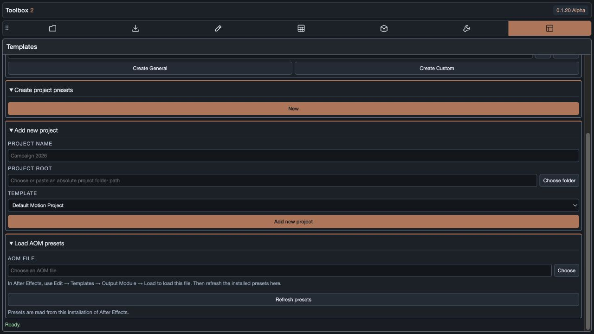

Choose an `.aom` file to read its visible output-module preset names. In After Effects, use **Edit → Templates → Output Module → Load** to install its settings, then **Refresh presets** in Toolbox.

The Projects render dropdown matches AOM names against installed AE output-module templates. Missing presets are marked **load in AE** and disabled. If no AOM filter is selected, the list comes from the installed AE presets. An installed preset with the same name but different settings uses **AE's installed settings**. Toolbox does not install codecs or apply codec settings directly from the file. AOM support covers the parsed binary layout with a 32 MB limit; invalid files report an error.

## Troubleshooting and validation

- **Toolbar/project data fails to load:** install 0.1.33 Alpha 1, restart After Effects, and verify the topper version. This release includes the Node/CommonJS template-store startup fix.
- **Project list is empty:** clear the search filter, confirm the selected library, then Refresh. Switching libraries does not merge local records.
- **Cannot save a shared preset:** check folder availability/write access, refresh after a revision conflict, and check for another active writer. Do not remove an active lock.
- **Render preset unavailable:** load the AOM settings into that AE installation and refresh; matching is by exact name.
- **No source project found:** the selected render needs explicit AE project-link metadata, not merely XMP or a color profile.
- **Color space unavailable:** unsupported/OCIO layouts and files above the inspection limit are not yet handled.
- **Checker media missing:** mount the library and dependencies; install required fonts/plugins; recapture legacy binary packages if layered media paths are no longer valid.

Automated tests cover the data model, ES3 syntax, host action mocks, checker packaging, revision conflicts, and exclusive locks. Native checker testing included multiple templates, nested placeholders, Job text, and relocated layered PSD media. The exact user reference checker project was unavailable. Windows native import, real network/two-machine locking, and a complete native 0.1.33 CEP verification remain unverified. Browser screenshots demonstrate layout only.

### Set Anchor and Step and Repeat

Both tools operate on selected layers in one Undo group. Locked layers are skipped with a status message.

- **Step and repeat:** arrows duplicate each layer adjacent to its full bounds in parent coordinates (world coordinates when unparented). Offset adds the entered gap. Dup duplicates in place. Position keys and separated dimensions retain their animation and receive the same translation. Cameras and lights can duplicate in place; directional movement requires an Offset because they have no visual bounds.
- **Set anchor:** choose a corner, edge midpoint, or center of Layer bounds. Comp instead projects the chosen composition point onto the layer's plane. Text and shape bounds include their actual left/top offsets. Normal mode shifts every existing Anchor Point key and compensates every Position key at its own time, preserving animation, scale, rotation, and parenting. Abs. shifts only Anchor Point. Separated 2D Position edits are limited to X and Y so After Effects' hidden Z follower is never written.
- Cameras and lights have no anchor point and are skipped by Set Anchor. Expression-driven Anchor Point/Position are left unchanged. Transform expressions on other properties are evaluated by AE. Degenerate transforms may be skipped if AE cannot resolve them.

Automated property/batch tests and the browser layout were checked. Native After Effects transform evaluation still requires a project-specific validation pass in After Effects.
