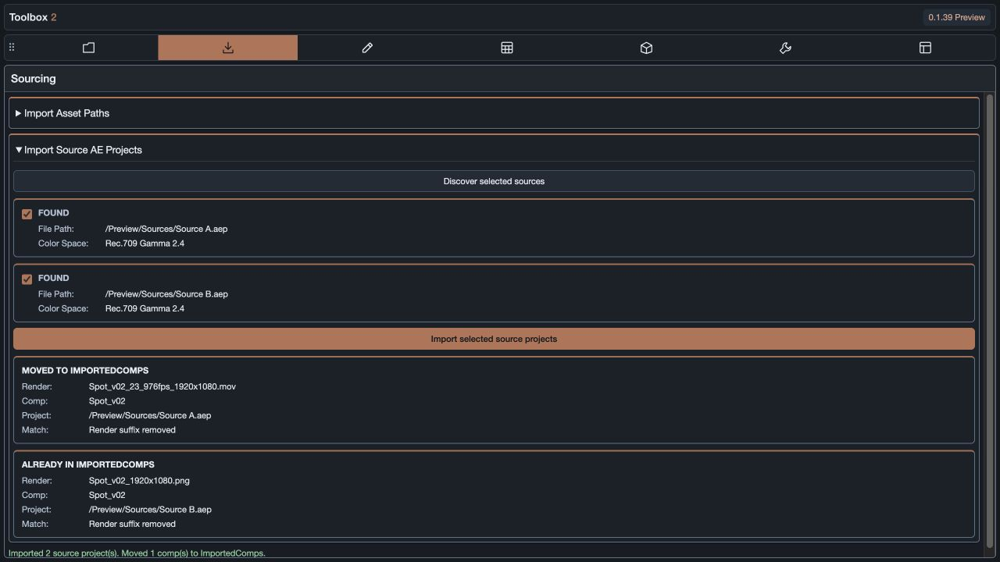

# Source composition matching

Available in Toolbox 2 **0.1.40**.

Under **Sourcing → Import Source AE Projects**, select rendered movies or images in After Effects, discover their source projects, and import the checked projects. The render's original filename is used even if its footage item has been renamed in AE.

Each render is matched only against compositions in its own imported source project. Matching prefers an exact name, then a name with recognized render suffixes removed, then the longest comp-name prefix ending at a separator. Case-insensitive matching is supported. Unrelated partial words are not matches.

For example, these renders can all identify `Spot_v02`:

| Render filename | Supported suffix |
| --- | --- |
| `Spot_v02.mov` | File extension only |
| `Spot_v02_24fps_1920x1080.mov` | FPS and dimensions |
| `Spot_v02_23_976fps_1920x1080.mov` | Decimal FPS encoded with an underscore |
| `Spot_v02_23.976fps_1920x1080.mov` | Legacy decimal FPS |
| `Spot_v02_1920x1080.png` | Dimensions without FPS |
| `Spot_v02_1920x1080_[#####].exr` | AE image-sequence token |
| `Spot_v02_1920x1080_00001.exr` | Rendered image frame number |

The suffix does not need to match the original comp's dimensions: half-resolution renders still identify the source comp. A closer full name wins over a shorter prefix, including when the comp itself has FPS or dimensions in its name.

Matched compositions move into the root-level **ImportedComps** folder. The rest of each imported project stays under **ImportedProjects**, including its dependencies and other comps. Moving a comp preserves its layers and source links.

Only one composition with an identical name is added to ImportedComps. The first copy is retained; copies from subsequent imported projects stay with their project folders. This also applies to repeat imports and comps already in ImportedComps. Name deduplication does not compare comp contents, replace existing comps, or delete duplicate source comps.

Each render receives a result module showing the render name, comp name, source project, and matching method. **Already in ImportedComps** means a same-named comp is already isolated. **No Match** or **Review Match** leaves the imported comps in their project folder for manual review; distinct equally ranked names are not chosen automatically.

The screenshot is a browser layout preview with simulated source records and import results. It demonstrates the result modules; it is not evidence of native project import.

## Validation

`tests/source-project-import.test.js` covers filename matching, project associations, nested live-folder changes, duplicate names, repeated imports, dependencies, ambiguous results, and import failures. `tests/source-project-import-native.jsx` imports two temporary copies of an AE project in After Effects and checks suffix matching and same-name isolation without saving the fixture or retaining test imports.

Automated tests and the browser layout check passed. Native verification also passed in After Effects 26.5: two actual `.aep` files were imported, an FPS/dimension-suffixed filename matched its source comp, and the second import reused the isolated name instead of adding another comp to ImportedComps. Temporary imports were removed after testing. Both local CEP installations are updated, and the open Toolbox panel was reopened to load the changes.
